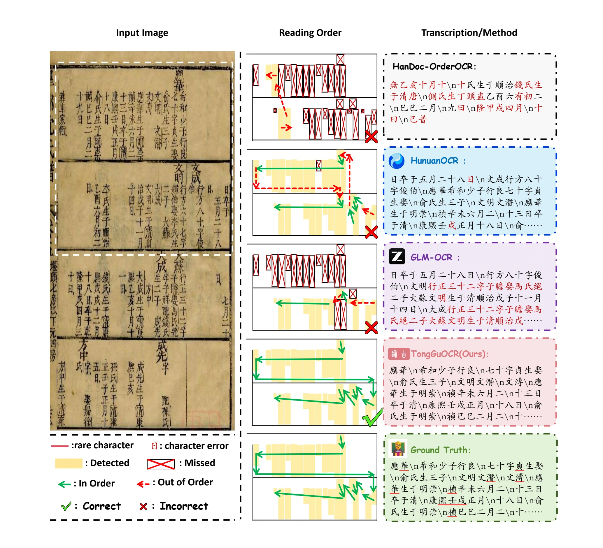

# TongGuOCR

TongGuOCR is an OCR project for Chinese historical documents.

[Project Page](https://jzzh2004.github.io/TongGuOCR)

The project code and model weights will be open-sourced after the paper is accepted and published.
