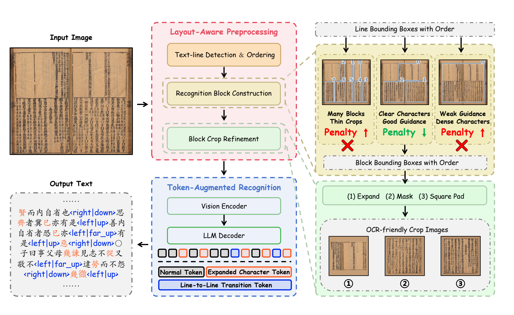

<div align="center">
  

  # TongGuOCR

  **面向中文历史文献的布局感知与词元增强 OCR 多模态大语言模型**

  [论文](https://arxiv.org/abs/2608.07917) ·
  [项目主页](https://jzzh2004.github.io/TongGuOCR) ·
  [在线演示](http://121.41.49.212:6767/)

  [English](README.md) · 简体中文
</div>

> **开源状态：** 本仓库目前用于托管 TongGuOCR 项目网站。模型权重与推理代码将在论文录用并正式发表后开源。

## 项目简介

TongGuOCR 是一个面向中文历史文献 OCR 的布局感知与词元增强多模态大语言模型（MLLM），主要解决复杂版面、历史生僻字和非平凡阅读顺序带来的识别难题。

该框架包含两个相互配合的核心模块：

- **布局感知预处理（Layout-Aware Preprocessing）**：构建并优化局部连贯的识别块，在保留有效上下文的同时减少不同区域之间的干扰。
- **词元增强识别（Token-Augmented Recognition）**：为生僻字提供直接的单词元表示，并引入行间跳转词元，引导模型沿复杂阅读路径完成解码。



## 核心特点

- **布局感知识别块：** 在复杂历史文献页面中兼顾局部上下文、字符清晰度与阅读顺序。
- **生僻字词表扩展：** 通过直接的字符级词元缩短难识别历史字形的解码路径。
- **显式跳转建模：** 无需精确坐标，即可编码文本行之间的粗粒度空间位移。
- **三阶段适配训练：** 逐步完成历史文献领域知识、高质量监督数据与识别块推理粒度的对齐。

## 实验结果

TongGuOCR 在两个中文历史文献 OCR 基准上取得了当前最佳性能。

| 数据集 | AR ↑ | CR ↑ | NED ↓ | RO-ED ↓ |
| --- | ---: | ---: | ---: | ---: |
| MTHv2 | **97.93** | **98.33** | **2.05** | **1.51** |
| M5HisDoc | **93.76** | **94.46** | **6.15** | **3.49** |

在更具挑战性的 M5HisDoc 基准上，相较各指标最优的竞争方法，TongGuOCR 将 NED 从 10.43 降低至 6.15，并将 RO-ED 从 7.53 降低至 3.49。完整对比实验、消融研究与定性结果请参阅[论文](https://arxiv.org/abs/2608.07917)和[项目主页](https://jzzh2004.github.io/TongGuOCR)。

## 项目网站

项目网站使用 React、TypeScript 和 Vite 构建。

```bash
cd website
npm install
npm run dev
```

其他常用命令：

```bash
npm run build
npm test
```

## 引用

如果 TongGuOCR 对你的研究有所帮助，请引用我们的论文：

```bibtex
@article{zhou2026tongguocr,
  title   = {TongGuOCR: A Layout-Aware and Token-Augmented OCR MLLM for Chinese Historical Documents},
  author  = {Zhou, Zhongheng and Sun, Yi and He, Huiguo and Zhang, Yuyi and Zhang, Peirong and Fang, Yulin and Peng, Dezhi and Liao, Minghui and Jin, Lianwen},
  journal = {arXiv preprint arXiv:2608.07917},
  year    = {2026}
}
```

## 致谢

TongGuOCR 由华南理工大学与华为技术有限公司的合作团队共同研发。感谢本研究所使用数据集与开源系统的创建者和维护者。
